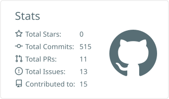
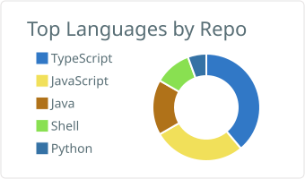

# Hi, I'm Jan 👋

Software developer working with JavaScript & TypeScript.

- 🔭 Currently building projects with **JavaScript / TypeScript**
- 🌱 Always learning new tools and patterns in the JS ecosystem
- 👯 Open to collaborating on interesting projects
- 💬 Ask me about JavaScript, TypeScript, or web development

## 🛠️ Tech Stack

## 📊 GitHub Stats

  
  

> Cards are generated by a scheduled [GitHub Action](.github/workflows/profile-summary-cards.yml) and committed
> straight into this repo, so they don't depend on a third-party service.
